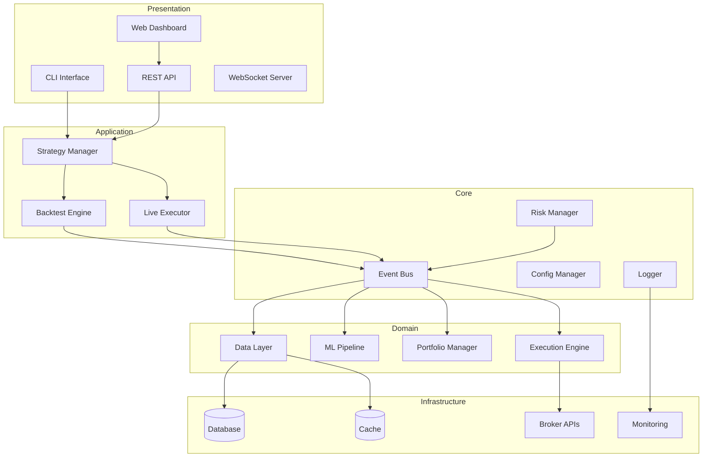
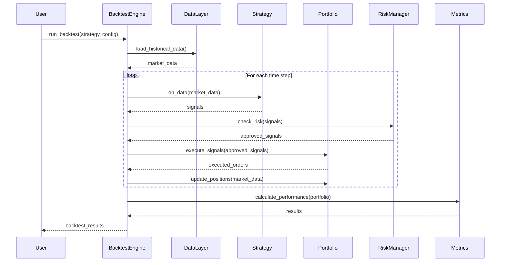
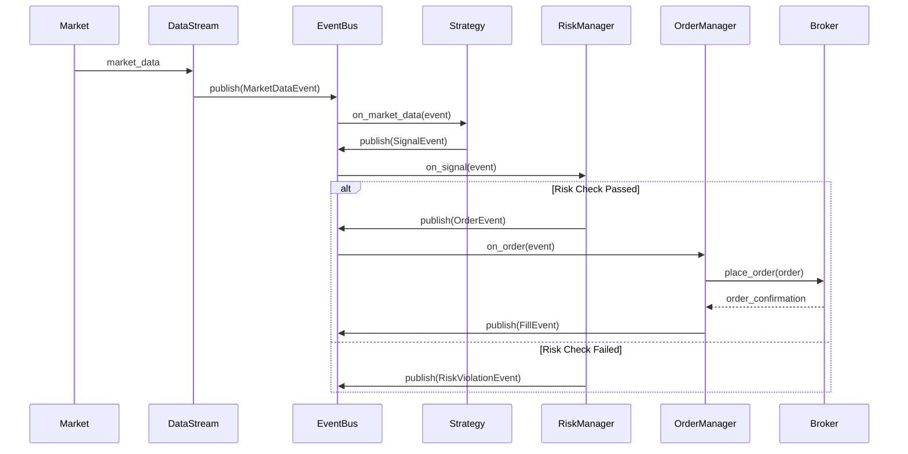
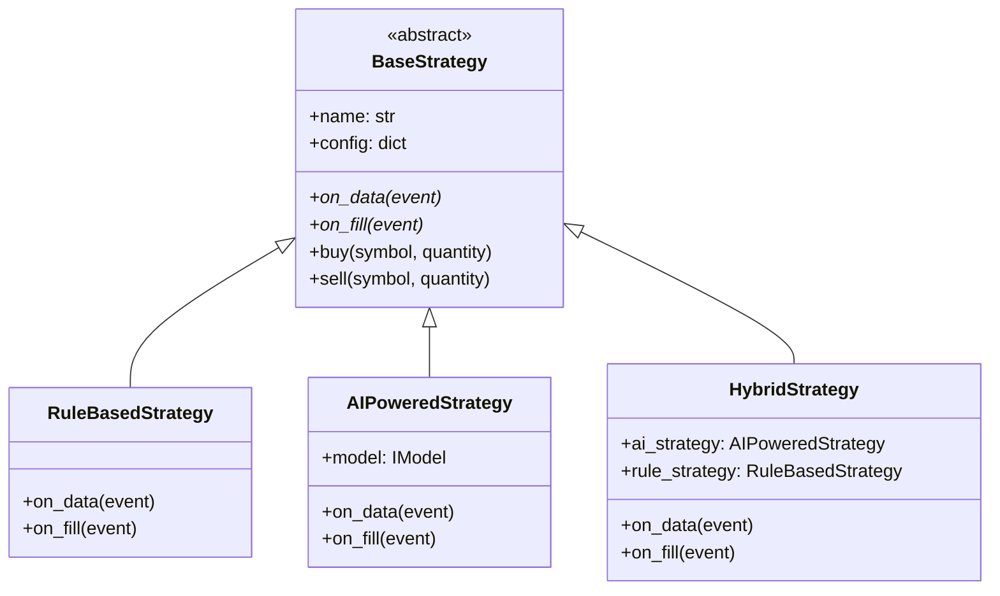

# System Architecture Document
# QuantX Trading System

**Version**: 1.0  
**Date**: November 25, 2025  
**Status**: Planning

---

## Table of Contents

1. [Architecture Overview](#1-architecture-overview)
2. [Design Principles](#2-design-principles)
3. [System Components](#3-system-components)
4. [Data Flow](#4-data-flow)
5. [Event-Driven Architecture](#5-event-driven-architecture)
6. [Module Specifications](#6-module-specifications)
7. [Technology Stack](#7-technology-stack)
8. [Deployment Architecture](#8-deployment-architecture)
9. [Security Architecture](#9-security-architecture)
10. [Scalability & Performance](#10-scalability--performance)

---

## 1. Architecture Overview

### 1.1 High-Level Architecture

QuantX follows a **layered, event-driven architecture** with clear separation of concerns:

```
┌───────────────────────────────────────────────────────────────────┐
│                         PRESENTATION LAYER                        │
│  ┌──────────┐  ┌──────────┐  ┌──────────┐  ┌──────────────────┐   │
│  │   CLI    │  │ REST API │  │ WebSocket│  │  Web Dashboard   │   │
│  └──────────┘  └──────────┘  └──────────┘  └──────────────────┘   │
└───────────────────────────────────────────────────────────────────┘
                                 │
┌───────────────────────────────────────────────────────────────────┐
│                        APPLICATION LAYER                          │
│  ┌─────────────────┐  ┌─────────────────┐  ┌─────────────────┐    │
│  │ Strategy Manager│  │ Backtest Engine │  │ Live Executor   │    │
│  └─────────────────┘  └─────────────────┘  └─────────────────┘    │
└───────────────────────────────────────────────────────────────────┘
                                 │
┌───────────────────────────────────────────────────────────────────┐
│                          CORE SERVICES                            │
│  ┌──────────┐  ┌──────────┐  ┌──────────┐  ┌──────────────────┐   │
│  │Event Bus │  │Config Mgr│  │  Logger  │  │  Risk Manager    │   │
│  └──────────┘  └──────────┘  └──────────┘  └──────────────────┘   │
└───────────────────────────────────────────────────────────────────┘
                                 │
┌───────────────────────────────────────────────────────────────────┐
│                          DOMAIN LAYER                             │
│  ┌──────────┐  ┌──────────┐  ┌──────────┐  ┌──────────────────┐   │
│  │Data Layer│  │ML Pipeline│ │Portfolio │  │Execution Engine  │   │
│  └──────────┘  └──────────┘  └──────────┘  └──────────────────┘   │
└───────────────────────────────────────────────────────────────────┘
                                 │
┌───────────────────────────────────────────────────────────────────┐
│                      INFRASTRUCTURE LAYER                         │
│  ┌──────────┐  ┌──────────┐  ┌──────────┐  ┌──────────────────┐   │
│  │ Database │  │  Cache   │  │ Brokers  │  │   Monitoring     │   │
│  │(Postgres)│  │ (Redis)  │  │  (APIs)  │  │ (Prometheus)     │   │
│  └──────────┘  └──────────┘  └──────────┘  └──────────────────┘   │
└───────────────────────────────────────────────────────────────────┘
```

### 1.2 Architectural Style

**Primary**: Event-Driven Architecture (EDA)  
**Secondary**: Layered Architecture  
**Patterns**: Plugin Architecture, Microkernel

**Rationale**:
- **Event-Driven**: Natural fit for trading (market events, order events)
- **Layered**: Clear separation of concerns, testability
- **Plugin**: Easy extensibility for strategies, data sources, brokers

---

## 2. Design Principles

### 2.1 SOLID Principles

#### Single Responsibility Principle (SRP)
Each class has one reason to change.

**Example**:
```python
# ❌ Bad: Multiple responsibilities
class Strategy:
    def generate_signals(self): ...
    def execute_orders(self): ...
    def calculate_metrics(self): ...

# ✅ Good: Single responsibility
class Strategy:
    def generate_signals(self): ...

class OrderExecutor:
    def execute_orders(self): ...

class PerformanceAnalyzer:
    def calculate_metrics(self): ...
```

#### Open/Closed Principle (OCP)
Open for extension, closed for modification.

**Example**:
```python
# Base strategy interface
class BaseStrategy(ABC):
    @abstractmethod
    def generate_signals(self, data: MarketData) -> Signal:
        pass

# Extend without modifying base
class MACrossoverStrategy(BaseStrategy):
    def generate_signals(self, data: MarketData) -> Signal:
        # Implementation
        pass
```

#### Liskov Substitution Principle (LSP)
Derived classes must be substitutable for base classes.

#### Interface Segregation Principle (ISP)
Many specific interfaces better than one general interface.

#### Dependency Inversion Principle (DIP)
Depend on abstractions, not concretions.

**Example**:
```python
# ❌ Bad: Depends on concrete class
class Backtester:
    def __init__(self):
        self.data_provider = YahooFinanceProvider()

# ✅ Good: Depends on abstraction
class Backtester:
    def __init__(self, data_provider: DataProvider):
        self.data_provider = data_provider
```

### 2.2 Additional Principles

1. **DRY (Don't Repeat Yourself)**: Avoid code duplication
2. **KISS (Keep It Simple, Stupid)**: Simplicity over complexity
3. **YAGNI (You Aren't Gonna Need It)**: Don't add unnecessary features
4. **Separation of Concerns**: Each module handles one aspect
5. **Composition over Inheritance**: Favor composition

---

## 3. System Components

### 3.1 Component Diagram



### 3.2 Component Responsibilities

| Component | Responsibility | Key Interfaces |
|-----------|---------------|----------------|
| **Strategy Manager** | Load, validate, orchestrate strategies | `IStrategy`, `IStrategyRegistry` |
| **Backtest Engine** | Simulate trading on historical data | `IBacktester`, `IPortfolio` |
| **Live Executor** | Execute strategies in live markets | `IExecutor`, `IBroker` |
| **Event Bus** | Publish/subscribe event routing | `IEventBus`, `IEventHandler` |
| **Data Layer** | Data ingestion, storage, retrieval | `IDataProvider`, `IDataStore` |
| **ML Pipeline** | Train, evaluate, deploy ML models | `IModel`, `ITrainer` |
| **Portfolio Manager** | Track positions, calculate P&L | `IPortfolio`, `IPosition` |
| **Execution Engine** | Order routing and management | `IOrderManager`, `IOrder` |
| **Risk Manager** | Pre-trade and post-trade risk checks | `IRiskCheck`, `IRiskLimit` |

---

## 4. Data Flow

### 4.1 Backtesting Data Flow



### 4.2 Live Trading Data Flow



---

## 5. Event-Driven Architecture

### 5.1 Event Types

```python
from enum import Enum
from dataclasses import dataclass
from datetime import datetime
from typing import Any

class EventType(Enum):
    MARKET_DATA = "market_data"
    SIGNAL = "signal"
    ORDER = "order"
    FILL = "fill"
    RISK_VIOLATION = "risk_violation"
    POSITION_UPDATE = "position_update"
    SYSTEM = "system"

@dataclass
class Event:
    event_type: EventType
    timestamp: datetime
    data: Any
    source: str
    priority: int = 0
```

### 5.2 Event Bus Implementation

```python
from typing import Callable, Dict, List
from queue import PriorityQueue
import threading

class EventBus:
    def __init__(self):
        self._subscribers: Dict[EventType, List[Callable]] = {}
        self._event_queue = PriorityQueue()
        self._running = False
        self._thread = None
    
    def subscribe(self, event_type: EventType, handler: Callable):
        """Subscribe to an event type"""
        if event_type not in self._subscribers:
            self._subscribers[event_type] = []
        self._subscribers[event_type].append(handler)
    
    def publish(self, event: Event):
        """Publish an event"""
        self._event_queue.put((event.priority, event))
    
    def start(self):
        """Start processing events"""
        self._running = True
        self._thread = threading.Thread(target=self._process_events)
        self._thread.start()
    
    def stop(self):
        """Stop processing events"""
        self._running = False
        if self._thread:
            self._thread.join()
    
    def _process_events(self):
        """Process events from queue"""
        while self._running:
            if not self._event_queue.empty():
                _, event = self._event_queue.get()
                self._dispatch_event(event)
    
    def _dispatch_event(self, event: Event):
        """Dispatch event to subscribers"""
        if event.event_type in self._subscribers:
            for handler in self._subscribers[event.event_type]:
                try:
                    handler(event)
                except Exception as e:
                    # Log error but continue processing
                    print(f"Error in event handler: {e}")
```

### 5.3 Event Flow Example

```python
# Strategy publishes signal event
signal_event = Event(
    event_type=EventType.SIGNAL,
    timestamp=datetime.now(),
    data={"symbol": "AAPL", "action": "BUY", "quantity": 100},
    source="MACrossoverStrategy"
)
event_bus.publish(signal_event)

# Risk manager subscribes to signals
def risk_check_handler(event: Event):
    signal = event.data
    if passes_risk_checks(signal):
        order_event = Event(
            event_type=EventType.ORDER,
            timestamp=datetime.now(),
            data=signal,
            source="RiskManager"
        )
        event_bus.publish(order_event)

event_bus.subscribe(EventType.SIGNAL, risk_check_handler)
```

---

## 6. Module Specifications

### 6.1 Strategy Module

**Purpose**: Define and execute trading strategies

**Key Classes**:

```python
from abc import ABC, abstractmethod
from typing import Optional

class BaseStrategy(ABC):
    """Base class for all strategies"""
    
    def __init__(self, name: str, config: dict):
        self.name = name
        self.config = config
        self.portfolio = None
        self.event_bus = None
    
    @abstractmethod
    def on_data(self, event: Event) -> None:
        """Called when new market data arrives"""
        pass
    
    @abstractmethod
    def on_fill(self, event: Event) -> None:
        """Called when order is filled"""
        pass
    
    def buy(self, symbol: str, quantity: int, price: Optional[float] = None):
        """Generate buy signal"""
        signal = Signal(
            symbol=symbol,
            action=Action.BUY,
            quantity=quantity,
            price=price,
            strategy=self.name
        )
        self.event_bus.publish(signal.to_event())
    
    def sell(self, symbol: str, quantity: int, price: Optional[float] = None):
        """Generate sell signal"""
        # Similar to buy
        pass

class RuleBasedStrategy(BaseStrategy):
    """Base for rule-based strategies"""
    pass

class AIPoweredStrategy(BaseStrategy):
    """Base for AI-powered strategies"""
    
    def __init__(self, name: str, config: dict, model: IModel):
        super().__init__(name, config)
        self.model = model

class HybridStrategy(BaseStrategy):
    """Combines AI and rule-based approaches"""
    
    def __init__(self, name: str, config: dict, 
                 ai_strategy: AIPoweredStrategy,
                 rule_strategy: RuleBasedStrategy):
        super().__init__(name, config)
        self.ai_strategy = ai_strategy
        self.rule_strategy = rule_strategy
```

**Strategy Registry**:

```python
class StrategyRegistry:
    """Registry for strategy classes"""
    
    _strategies: Dict[str, Type[BaseStrategy]] = {}
    
    @classmethod
    def register(cls, name: str):
        """Decorator to register strategy"""
        def decorator(strategy_class):
            cls._strategies[name] = strategy_class
            return strategy_class
        return decorator
    
    @classmethod
    def create(cls, name: str, config: dict) -> BaseStrategy:
        """Create strategy instance"""
        if name not in cls._strategies:
            raise ValueError(f"Strategy {name} not registered")
        return cls._strategies[name](name, config)

# Usage
@StrategyRegistry.register("ma_crossover")
class MACrossoverStrategy(RuleBasedStrategy):
    def on_data(self, event: Event):
        # Implementation
        pass
```

### 6.2 Data Module

**Purpose**: Handle data ingestion, storage, and retrieval

**Key Interfaces**:

```python
class IDataProvider(ABC):
    """Interface for data providers"""
    
    @abstractmethod
    def get_historical_data(self, symbol: str, start: datetime, 
                           end: datetime, interval: str) -> pd.DataFrame:
        """Fetch historical OHLCV data"""
        pass
    
    @abstractmethod
    def get_realtime_data(self, symbols: List[str]) -> Iterator[MarketData]:
        """Stream real-time market data"""
        pass

class IDataStore(ABC):
    """Interface for data storage"""
    
    @abstractmethod
    def save(self, data: pd.DataFrame, table: str) -> None:
        """Save data to storage"""
        pass
    
    @abstractmethod
    def load(self, table: str, filters: dict) -> pd.DataFrame:
        """Load data from storage"""
        pass
```

**Implementations**:

```python
class YahooFinanceProvider(IDataProvider):
    """Yahoo Finance data provider"""
    
    def get_historical_data(self, symbol: str, start: datetime,
                           end: datetime, interval: str) -> pd.DataFrame:
        import yfinance as yf
        ticker = yf.Ticker(symbol)
        return ticker.history(start=start, end=end, interval=interval)

class PostgresDataStore(IDataStore):
    """PostgreSQL data storage"""
    
    def __init__(self, connection_string: str):
        self.engine = create_engine(connection_string)
    
    def save(self, data: pd.DataFrame, table: str) -> None:
        data.to_sql(table, self.engine, if_exists='append')
    
    def load(self, table: str, filters: dict) -> pd.DataFrame:
        query = self._build_query(table, filters)
        return pd.read_sql(query, self.engine)
```

### 6.3 ML Module

**Purpose**: Machine learning model training and inference

**Key Classes**:

```python
class IModel(ABC):
    """Interface for ML models"""
    
    @abstractmethod
    def train(self, X: np.ndarray, y: np.ndarray) -> None:
        """Train the model"""
        pass
    
    @abstractmethod
    def predict(self, X: np.ndarray) -> np.ndarray:
        """Make predictions"""
        pass
    
    @abstractmethod
    def save(self, path: str) -> None:
        """Save model to disk"""
        pass
    
    @classmethod
    @abstractmethod
    def load(cls, path: str) -> 'IModel':
        """Load model from disk"""
        pass

class LSTMPredictor(IModel):
    """LSTM model for time series prediction"""
    
    def __init__(self, input_dim: int, hidden_dim: int, output_dim: int):
        self.model = self._build_model(input_dim, hidden_dim, output_dim)
    
    def _build_model(self, input_dim, hidden_dim, output_dim):
        import torch.nn as nn
        return nn.LSTM(input_dim, hidden_dim, batch_first=True)
    
    def train(self, X: np.ndarray, y: np.ndarray) -> None:
        # Training implementation
        pass
```

### 6.4 Portfolio Module

**Purpose**: Track positions and calculate P&L

```python
class Portfolio:
    """Portfolio management"""
    
    def __init__(self, initial_capital: float):
        self.initial_capital = initial_capital
        self.cash = initial_capital
        self.positions: Dict[str, Position] = {}
        self.trades: List[Trade] = []
    
    def update_position(self, symbol: str, quantity: int, price: float):
        """Update position after trade"""
        if symbol not in self.positions:
            self.positions[symbol] = Position(symbol)
        
        self.positions[symbol].update(quantity, price)
        self.cash -= quantity * price
    
    def get_total_value(self, current_prices: Dict[str, float]) -> float:
        """Calculate total portfolio value"""
        positions_value = sum(
            pos.quantity * current_prices.get(pos.symbol, 0)
            for pos in self.positions.values()
        )
        return self.cash + positions_value
    
    def get_pnl(self, current_prices: Dict[str, float]) -> float:
        """Calculate profit/loss"""
        return self.get_total_value(current_prices) - self.initial_capital
```

### 6.5 Risk Management Module

**Purpose**: Pre-trade and post-trade risk checks

```python
class RiskManager:
    """Risk management system"""
    
    def __init__(self, config: dict):
        self.config = config
        self.checks: List[IRiskCheck] = self._initialize_checks()
    
    def check_order(self, order: Order, portfolio: Portfolio) -> bool:
        """Run all risk checks on order"""
        for check in self.checks:
            if not check.validate(order, portfolio):
                return False
        return True

class IRiskCheck(ABC):
    """Interface for risk checks"""
    
    @abstractmethod
    def validate(self, order: Order, portfolio: Portfolio) -> bool:
        pass

class MaxPositionSizeCheck(IRiskCheck):
    """Check maximum position size"""
    
    def __init__(self, max_position_pct: float):
        self.max_position_pct = max_position_pct
    
    def validate(self, order: Order, portfolio: Portfolio) -> bool:
        position_value = order.quantity * order.price
        portfolio_value = portfolio.get_total_value({})
        return (position_value / portfolio_value) <= self.max_position_pct
```

---

## 7. Technology Stack

### 7.1 Core Technologies

| Layer | Technology | Purpose |
|-------|-----------|---------|
| **Language** | Python 3.11+ | Main development language |
| **Data Processing** | pandas, numpy, polars | Data manipulation |
| **ML/AI** | PyTorch, scikit-learn, XGBoost | Machine learning |
| **Database** | PostgreSQL, TimescaleDB | Data storage |
| **Cache** | Redis | Fast data access |
| **API** | FastAPI | REST API |
| **WebSocket** | websockets | Real-time communication |
| **Testing** | pytest, hypothesis | Testing framework |
| **Monitoring** | Prometheus, Grafana | System monitoring |
| **Containerization** | Docker, docker-compose | Deployment |

### 7.2 Dependency Management

Using **Poetry** for dependency management:

```toml
[tool.poetry]
name = "quantx"
version = "0.1.0"
description = "AI-Powered & Rule-Based Trading System"
authors = ["QuantX Team"]

[tool.poetry.dependencies]
python = "^3.11"
pandas = "^2.0"
numpy = "^1.24"
scikit-learn = "^1.3"
torch = "^2.0"
fastapi = "^0.100"
sqlalchemy = "^2.0"
redis = "^4.5"
```

---

## 8. Deployment Architecture

### 8.1 Development Environment

```
┌─────────────────────────────────────┐
│         Developer Machine            │
│  ┌────────────────────────────────┐ │
│  │  QuantX Application            │ │
│  │  (Running locally)             │ │
│  └────────────────────────────────┘ │
│  ┌────────────────────────────────┐ │
│  │  Local PostgreSQL              │ │
│  └────────────────────────────────┘ │
└─────────────────────────────────────┘
```

### 8.2 Production Environment

```
┌─────────────────────────────────────────────────────────┐
│                    Load Balancer                         │
└─────────────────────────────────────────────────────────┘
                          │
        ┌─────────────────┼─────────────────┐
        │                 │                 │
┌───────▼──────┐  ┌───────▼──────┐  ┌──────▼───────┐
│ API Server 1 │  │ API Server 2 │  │ API Server N │
└──────────────┘  └──────────────┘  └──────────────┘
        │                 │                 │
        └─────────────────┼─────────────────┘
                          │
        ┌─────────────────┼─────────────────┐
        │                 │                 │
┌───────▼──────┐  ┌───────▼──────┐  ┌──────▼───────┐
│  PostgreSQL  │  │    Redis     │  │  Prometheus  │
│  (Primary)   │  │   (Cache)    │  │ (Monitoring) │
└──────────────┘  └──────────────┘  └──────────────┘
```

---

## 9. Security Architecture

### 9.1 Security Layers

1. **Authentication**: JWT tokens for API access
2. **Authorization**: Role-based access control (RBAC)
3. **Encryption**: TLS/SSL for all communications
4. **Secrets Management**: Environment variables, vault
5. **Audit Logging**: All trades and system events logged

### 9.2 Security Best Practices

- API keys encrypted at rest
- No hardcoded credentials
- Regular security audits
- Principle of least privilege
- Input validation and sanitization

---

## 10. Scalability & Performance

### 10.1 Performance Targets

| Metric | Target | Measurement |
|--------|--------|-------------|
| API Latency (p95) | < 100ms | Response time |
| Backtest Throughput | > 1M bars/min | Processing speed |
| Order Execution | < 500ms | End-to-end latency |
| System Uptime | > 99.9% | Availability |
| Concurrent Strategies | 100+ | Scalability |

### 10.2 Scalability Strategies

1. **Horizontal Scaling**: Add more API servers
2. **Database Sharding**: Partition data by symbol/date
3. **Caching**: Redis for frequently accessed data
4. **Async Processing**: Event-driven, non-blocking I/O
5. **Load Balancing**: Distribute requests across servers

---

## Appendix A: Class Diagrams



---

**Document Status**: Draft  
**Next Steps**: Implementation planning  
**Review Date**: TBD
